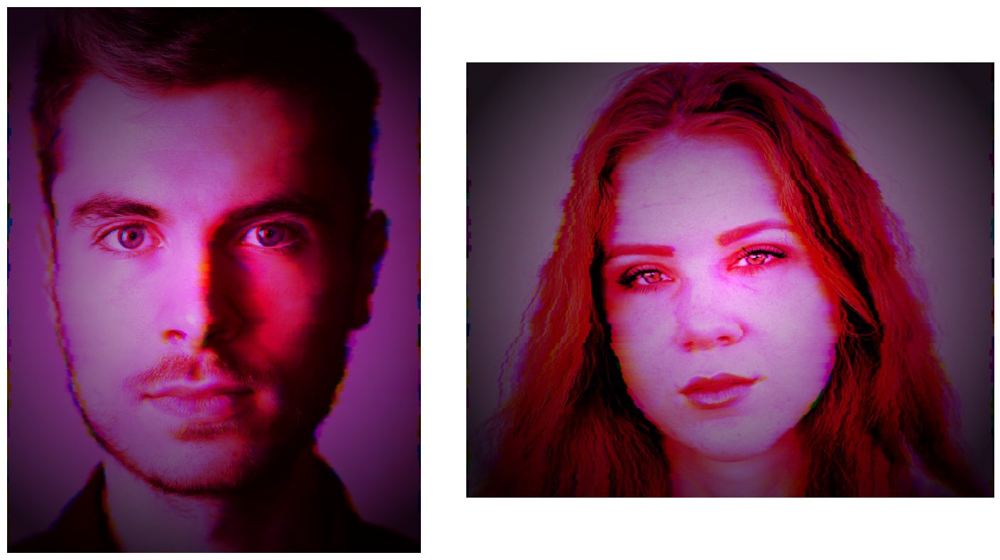

# Cyberpunk Filter Design
###### Created by Emir Yorgun

## Introduction
The Cyberpunk Filter Design project aims to develop unique and visually appealing filters inspired by the cyberpunk genre. This project aims to design filters with a cyberpunk aesthetic using low-level image manipulation in Python. These filters can be used in various applications such as image processing, video editing, and artistic projects.

## Features
- **Cyberpunk Aesthetic**: Filters inspired by neon lights, high contrast, and futuristic elements typical of cyberpunk art.
- **Customizable**: Easily adjust the filter parameters to create your own unique effects.

## Installation
To get started with the Cyberpunk Filter Design project, follow these steps:

1. Clone the repository:
   ```bash
   git clone https://github.com/hootbu/Cyberpunk-Filter-Desing.git
   ```
2. Navigate to the project directory:
   ```bash
   cd Cyberpunk-Filter-Desing
   ```
3. Install the required dependencies:
   ```bash
   pip install -r requirements.txt
   ```

## Usage
Open the Jupyter Notebook and explore the different filters available in the project. You can modify the parameters and see the results in real time.

1. Start Jupyter Notebook:
   ```bash
   Jupiter notebook
   ```
2. Open the `filter.ipynb` file and follow the instructions to apply and customize filters.

## Examples
Examples of outputs from the Cyberpunk Aesthetic Filter:


